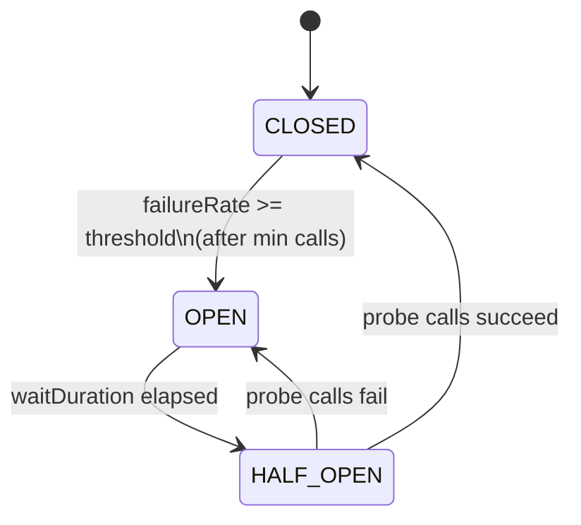
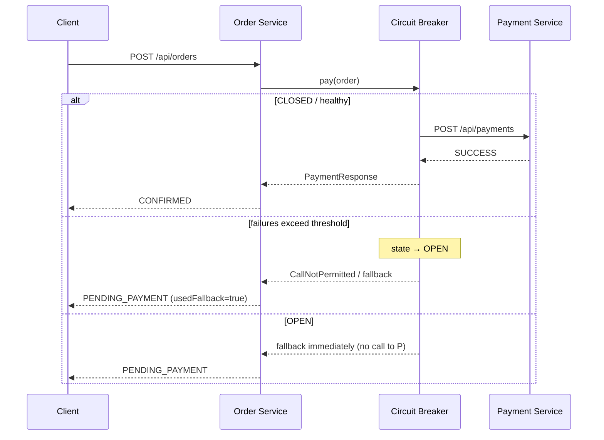

# 01 — Circuit Breaker Pattern

**Real-life example:** E-commerce **Order Service** calls **Payment Service** (like Razorpay/Stripe).  
When payment is down or slow, Order Service must **not** cascade-fail — it opens the circuit and returns a graceful fallback (`PENDING_PAYMENT`).

| Service | Port | Role |
|---|---|---|
| `payment-service` | 8081 | Downstream dependency (can FAIL / SLOW) |
| `order-service` | 8082 | Caller with **Resilience4j Circuit Breaker** |

---

## 1. Problem (say this first in interviews)

> If Payment Service is down or very slow, every Order API thread waits/fails.  
> Under load this exhausts threads → **cascading failure** across the system.  
> Circuit Breaker **fails fast**, stops calling the unhealthy dependency for a while, and serves a **fallback**.

---

## 2. Architecture

```text
┌────────────┐     HTTP POST /api/orders      ┌─────────────────┐
│   Client   │ ──────────────────────────────►│  Order Service  │
│ (Postman)  │                                │     :8082       │
└────────────┘                                │                 │
                                              │  ┌───────────┐  │
                                              │  │ Circuit   │  │
                                              │  │ Breaker   │  │
                                              │  │ + Timeout │  │
                                              │  └─────┬─────┘  │
                                              └────────┼────────┘
                                                       │
                         CLOSED: call payment          │  OPEN: skip call → fallback
                         HALF_OPEN: probe 1–2 calls    │
                                                       ▼
                                              ┌─────────────────┐
                                              │ Payment Service │
                                              │     :8081       │
                                              │ (NONE/FAIL/SLOW)│
                                              └─────────────────┘
```

---

## 3. State machine (must memorize)



| State | Behavior |
|---|---|
| **CLOSED** | Normal — calls go to Payment Service |
| **OPEN** | Fail fast — **no** call to Payment; invoke fallback immediately |
| **HALF_OPEN** | Allow limited probe calls; decide close vs open again |

---

## 4. Request flow



---

## 5. Key config (interview-ready knobs)

From `order-service` `application.properties`:

| Property | Demo value | Meaning |
|---|---|---|
| `slidingWindowSize` | 6 | Look at last N calls |
| `minimumNumberOfCalls` | 4 | Don't open until enough samples |
| `failureRateThreshold` | 50% | Open if ≥50% failed |
| `waitDurationInOpenState` | 30s | Stay OPEN before probing (longer = easier to catch OPEN in demos) |
| `permittedNumberOfCallsInHalfOpenState` | 2 | Probe budget |
| `slowCallDurationThreshold` | 2s | Slow counts as failure signal |
| TimeLimiter `timeoutDuration` | 2s | Hard timeout on payment call |

**Fallback idea to say aloud:**  
*"We don't fail the order hard — we mark `PENDING_PAYMENT` and can retry / notify later (Outbox + scheduler in real systems)."*

---

## 6. How to run

### Terminal 1 — Payment Service
```bash
cd D:\planning-preparation-Execution\GITHUB-CHECKIN\microservice-design-patterns\01-circuit-breaker\payment-service
mvn spring-boot:run
```

### Terminal 2 — Order Service
```bash
cd D:\planning-preparation-Execution\GITHUB-CHECKIN\microservice-design-patterns\01-circuit-breaker\order-service
mvn spring-boot:run
```

---

## 7. Demo script (practice this)

### Step A — Happy path (CLOSED)
```bash
curl -X POST http://localhost:8082/api/orders -H "Content-Type: application/json" -d "{\"customerId\":\"CUST-1\",\"productId\":\"SKU-100\",\"quantity\":1,\"amount\":999.0}"
```
Expect: `"status":"CONFIRMED"`, `"usedFallback":false`

Check breaker:
```bash
curl http://localhost:8082/api/orders/circuit-status
```
Expect: `"state":"CLOSED"`

### Step B — Break Payment (trip the circuit)
```bash
curl -X POST "http://localhost:8081/api/payments/failure-mode?mode=FAIL"
```

Fire 5–6 orders quickly:
```bash
curl -X POST http://localhost:8082/api/orders -H "Content-Type: application/json" -d "{\"customerId\":\"CUST-1\",\"productId\":\"SKU-100\",\"quantity\":1,\"amount\":999.0}"
```

Watch:
- First failures → still calling payment
- Then `"usedFallback":true`, `"status":"PENDING_PAYMENT"`
- Check `circuit-status` **immediately** → `"state":"OPEN"`
- If you wait > `waitDurationInOpenState` (30s), it auto-moves to `HALF_OPEN` (normal — you did not miss a bug)

### Step C — Recovery (HALF_OPEN → CLOSED)
```bash
curl -X POST "http://localhost:8081/api/payments/failure-mode?mode=NONE"
```
Wait ~30 seconds (or until status shows HALF_OPEN), then place 2–3 orders.  
Expect: state moves `OPEN → HALF_OPEN → CLOSED`, orders become `CONFIRMED` again.

### Step D — Slow calls (optional)
```bash
curl -X POST "http://localhost:8081/api/payments/failure-mode?mode=SLOW"
```
Payment sleeps 3s; TimeLimiter (2s) / slow-call threshold trips breaker similarly.

### Useful endpoints
| URL | Purpose |
|---|---|
| `GET http://localhost:8082/api/orders/circuit-status` | Human-readable breaker state |
| `GET http://localhost:8082/actuator/circuitbreakers` | Actuator view |
| `GET http://localhost:8082/actuator/health` | Health includes CB |
| `GET http://localhost:8081/api/payments/failure-mode` | Current payment failure mode |

---

## 8. Code map (what to open while explaining)

| File | What to highlight |
|---|---|
| `PaymentClient.java` | `@CircuitBreaker` + `@TimeLimiter` + `fallbackMethod` |
| `application.properties` (order) | Thresholds, window, wait duration |
| `PaymentController.java` | Runtime `failure-mode` switch for live demo |
| `OrderService.java` | Business meaning of fallback → `PENDING_PAYMENT` |

---

## 9. Interview Q&A (high probability)

**Q: Circuit Breaker vs Retry?**  
A: Retry helps **transient** blips. Circuit Breaker stops calling when dependency is **clearly unhealthy**. Often used together: Retry (limited) inside Closed state; when Open, no retries.

**Q: Where do you put the breaker — gateway or service?**  
A: Usually on the **caller** around the specific outbound dependency. Gateway-level is possible for coarse protection; service-level is more precise.

**Q: What is Bulkhead?**  
A: Isolates thread/connection pools per dependency so one slow service doesn't starve others. Pair with CB.

**Q: Fallback best practices?**  
A: Return stale cache / queue for later / degraded response. Never pretend payment succeeded if money wasn't captured.

**Q: Resilience4j vs Hystrix?**  
A: Hystrix is in maintenance. Industry standard now is **Resilience4j** (lightweight, functional, Micrometer-friendly).

**Q: How do you monitor in production?**  
A: Actuator + Micrometer/Prometheus metrics (`resilience4j.circuitbreaker.*`), alerts on state=OPEN, dashboards + tracing.

---

## 10. 90-second pitch (memorize)

> "In our order flow, payment is a critical dependency. I wrap the payment client with Resilience4j Circuit Breaker and TimeLimiter.  
> If failure or slow-call rate crosses 50% in a sliding window, the breaker opens for 10 seconds and we fail fast to a fallback that marks the order `PENDING_PAYMENT` instead of cascading timeouts.  
> After the wait, half-open probes decide whether to close again. This protects Order Service threads and keeps the API responsive during payment outages."

---

## Next pattern

→ **02 — Saga** (Order → Payment → Inventory distributed transaction with compensation)
