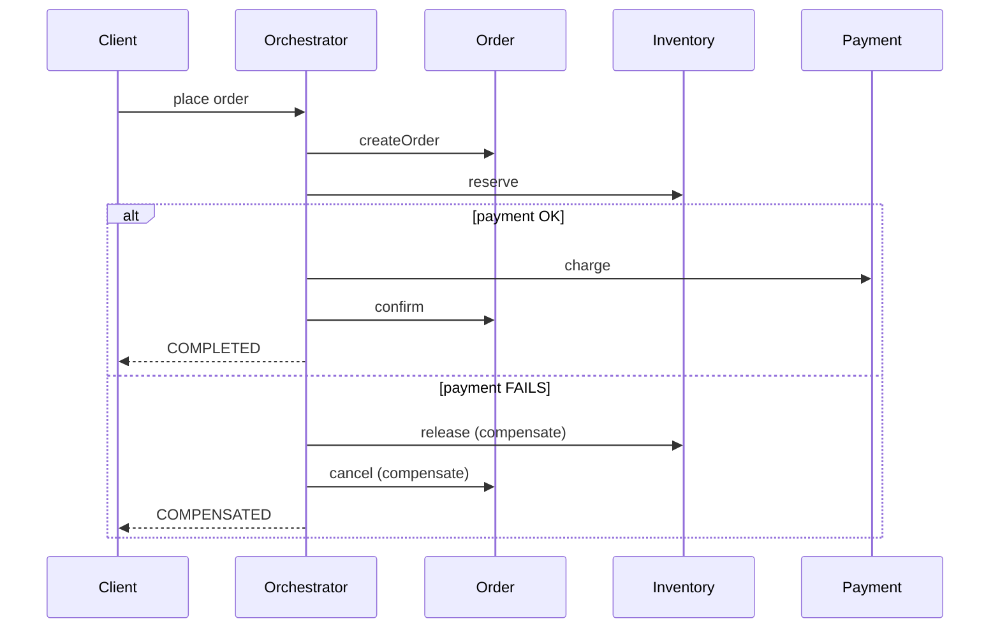

# 02 — Saga Pattern

**Real-life example:** E-commerce place-order flow across services that **cannot share one DB transaction**.

| Step | Forward action | Compensation (undo) |
|---|---|---|
| 1 | Create Order (PENDING) | Cancel Order |
| 2 | Reserve Inventory | Release Inventory |
| 3 | Charge Payment | Refund Payment |
| 4 | Confirm Order | — (only if all succeeded) |

**Demo style:** **Orchestration** (central `OrderSagaOrchestrator`) — clearest for interviews.  
**Choreography:** overview + interview notes in **`CHOREOGRAPHY.md`** — code later with Event-Driven / Kafka.

| App | Port |
|---|---|
| `saga-demo` | **8090** |

---

## 1. Problem (say this first)

> Order, Inventory, and Payment are separate services with **separate databases**.  
> You **cannot** use a single ACID `@Transactional` across them.  
> Saga = sequence of **local transactions** + **compensating actions** if a later step fails → keep data **eventually consistent**.

---

## 2. Architecture (Orchestration — what we coded)

```text
                    ┌─────────────────────────┐
   Client ────────► │  OrderSagaOrchestrator  │
                    │     (central boss)      │
                    └───────────┬─────────────┘
            ┌───────────────────┼───────────────────┐
            ▼                   ▼                   ▼
     OrderService        InventoryService     PaymentService
     create/cancel       reserve/release      charge/refund
```



---

## 3. Orchestration vs Choreography (must know)

| | **Orchestration** (this demo) | **Choreography** |
|---|---|---|
| Who decides next step? | Central orchestrator | Each service reacts to events |
| Coupling | Orchestrator knows the flow | Services know fewer peers; coupled via events |
| Visibility | Easy to see/debug saga state | Harder; distributed flow |
| Failure handling | Orchestrator runs compensations | Services emit failure events; others compensate |
| Typical tech | Orchestrator service / Temporal / Camunda | Kafka events |

```text
Choreography sketch:
  OrderCreated → Inventory reserves → InventoryReserved → Payment charges
  PaymentFailed → InventoryReleased → OrderCancelled
```

**Dedicated note (overview + architecture + interview Q&A):** → **`CHOREOGRAPHY.md`**  
Implementation with Kafka → after Event-Driven learning (no code in this folder yet).

---

## 4. How to run

```powershell
cd D:\planning-preparation-Execution\MICROSERVICES_NOTES\GITHUB_CHECKIN\MICROSERVICE-DESIGN-PATTERNS\02-saga\saga-demo
mvn spring-boot:run
```

See **DEMO.md** for API calls (happy path + payment fail + inventory fail).

---

## 5. Code map

| File | Highlight |
|---|---|
| `OrderSagaOrchestrator.java` | Forward steps + `compensate()` reverse order |
| `OrderService` / `InventoryService` / `PaymentService` | Local txn + compensation method |
| `SagaInstance` | Tracks completed step IDs for safe undo |
| `SagaController` | `/orders`, `/failure-mode` |

---

## 6. 90-second pitch

> "When an order spans inventory and payment with separate databases, we use a Saga.  
> I implemented orchestration: a coordinator creates the order, reserves stock, then charges payment.  
> If payment fails, it compensates in reverse — release inventory, cancel order — so we stay consistent without a distributed 2PC transaction.  
> Orchestration is easier to reason about; choreography uses domain events instead of a central boss."

---

## Next

→ **03 — API Gateway** (or CQRS / Service Discovery per roadmap)
