```mermaid
sequenceDiagram
    participant C as Client
    participant G as API Gateway :8080
    participant O as Order :8101
    participant P as Product :8102

    C->>G: GET /api/products
    G->>G: GlobalFilter adds X-Request-Id
    G->>P: GET /products (+ X-Gateway)
    P-->>G: product list
    G-->>C: response

    C->>G: POST /api/orders
    G->>O: POST /orders
    O-->>G: created
    G-->>C: response
```

# 03 — API Gateway

**Category:** Communication / edge pattern  
**Real-life:** Mobile/Web apps call **one** entry URL; gateway routes to Order / Product services.

## Apps in this folder

| App | Port | Role |
|---|---|---|
| `order-backend` | 8101 | **COMMON** downstream order APIs |
| `product-backend` | 8102 | **COMMON** downstream product APIs |
| `api-gateway` | **8080** | Basic gateway — routing + requestId |
| `api-gateway-auth-ratelimit` | **8085** | **Separate** — JWT auth + rate limiting |

Shared backends: start once, use either gateway.

---

### Learn path
1. Basic gateway (`:8080`) — routing / rewrite / filters → `DEMO.md`, `FLOW.md`  
2. Secured gateway (`:8085`) — JWT + rate limit → `DEMO-AUTH-RATE-LIMIT.md`  
3. Interview system design → **`DESIGN-RATE-LIMITING-SYSTEM.md`** (often asked)

---

## 1. Problem

Without a gateway:
- Client must know many service URLs/ports  
- Auth, logging, rate-limit repeated in every service  
- Hard to change internal service layout  

**API Gateway** = single entry point in front of microservices.

---

## 2. Architecture

```text
        Mobile / Web / Postman
                 │
                 ▼
        ┌─────────────────┐
        │   API Gateway   │  :8080
        │  routes+filters │
        └────────┬────────┘
           ┌─────┴─────┐
           ▼           ▼
     order-backend  product-backend
        :8101          :8102
```



---

## 3. What this demo shows

| Feature | How |
|---|---|
| Routing | `/api/orders/**` → order-backend; `/api/products/**` → product-backend |
| Path rewrite | `/api/orders/1` → `/orders/1` |
| Route filter | `AddRequestHeader=X-Gateway, api-gateway` |
| Global filter | `RequestIdGlobalFilter` adds/propagates `X-Request-Id` |
| Error filter | `StructuredErrorGlobalFilter` → structured 503 JSON on downstream failure |

Production also often adds: JWT auth, rate limiting, SSL termination, canary routing (mentioned in notes).

---

## 4. How to run (3 terminals)

```powershell
# Terminal 1
cd ...\03-api-gateway\order-backend
mvn spring-boot:run

# Terminal 2
cd ...\03-api-gateway\product-backend
mvn spring-boot:run

# Terminal 3
cd ...\03-api-gateway\api-gateway
mvn spring-boot:run
```

See **DEMO.md** and **FLOW.md**.

---

## 5. 90-second pitch

> “API Gateway is the single entry for clients. In my demo Spring Cloud Gateway on 8080 routes /api/orders to the order service and /api/products to the product service, rewrites paths, and applies cross-cutting filters like correlation IDs. Backends stay private; clients don’t hardcode multiple service URLs.”

---

## Next

→ **Service Discovery** (dynamic URIs instead of localhost ports) → Event-Driven + choreography
