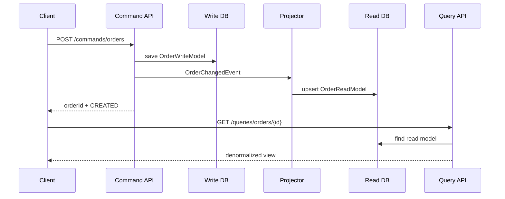

# 04 — CQRS (Command Query Responsibility Segregation)

**Category:** Data / Database pattern (with Saga, Database-per-Service)

**Real-life example:** E-commerce **Order**
- **Write (Command):** place / cancel order → normalized write DB  
- **Read (Query):** order details / customer order list → denormalized read model (fast UI)

| App | Port |
|---|---|
| `cqrs-demo` | **8091** |

---

## 1. Problem

One model doing both writes and heavy reads becomes painful:
- Complex joins for dashboards slow down writes  
- You want to scale reads differently from writes  
- UI needs a flat “summary” shape; domain needs strict write rules  

**CQRS:** split **commands** (change state) from **queries** (read state).

---

## 2. Architecture

```text
                 COMMAND side                         QUERY side
            ┌─────────────────────┐              ┌─────────────────────┐
 Client ──► │ Place/Cancel Order  │              │ GET order / list    │
            │ OrderCommandService │              │ OrderQueryService   │
            └─────────┬───────────┘              └─────────▲───────────┘
                      │ write                              │ read
                      ▼                                    │
            ┌─────────────────────┐     project    ┌───────┴───────────┐
            │   WRITE model DB    │ ─────────────► │   READ model DB   │
            │  (OrderWriteModel)  │  OrderChanged  │ (OrderReadModel)  │
            └─────────────────────┘     Event      └───────────────────┘
```



---

## 3. Consistency note (interview)

CQRS often means **eventual consistency** between write and read models  
(in our demo projection is in-process and almost immediate; production may use Kafka and lag seconds).

---

## 4. How to run

```powershell
cd D:\planning-preparation-Execution\MICROSERVICES_NOTES\GITHUB_CHECKIN\MICROSERVICE-DESIGN-PATTERNS\04-cqrs\cqrs-demo
mvn spring-boot:run
```

See **DEMO.md** for API steps.

---

## 5. Code map

| Package / file | Role |
|---|---|
| `command/*` | Write model, commands, command service |
| `query/*` | Read model, query service |
| `projection/OrderReadModelProjector` | Sync write → read |
| `api/CqrsController` | `/commands` vs `/queries` APIs |

Flow detail: **[FLOW.md](./FLOW.md)** (also `CQRS-FLOW-CONTROLLER-TO-SERVICE.md`)

---

## 6. 90-second pitch

> “CQRS separates the write path from the read path. Orders are created on a write model with business rules; a projection updates a denormalized read model used by listing APIs. That lets us optimize and scale reads independently. It’s a data pattern — often paired with events, and it usually implies eventual consistency between models.”

---

## Next

→ **API Gateway** (you planned this after CQRS) → then Service Discovery / Event-Driven (+ choreography)
